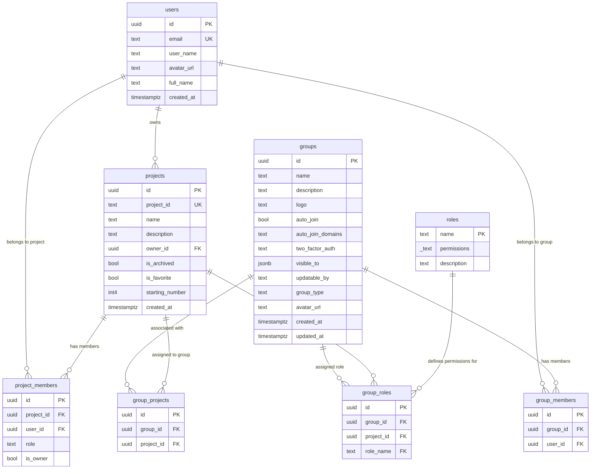

# Entity Relationship Diagram (ERD) - Access Control & Governance

هذا المخطط يوضح العلاقات بين المستخدمين (`users`)، المشروعات (`projects`)، المجموعات (`groups`)، والأدوار (`roles`) والجداول الوسيطة التي تربط بينها.

## شرح العلاقات في المخطط

1. **`users` ↔ `projects` (إمّا عبر `owner_id` أو `project_members`)**:
   - `users` إلى `projects` عبر `owner_id`: يحدد مالك المشروع الأساسي.
   - `users` إلى `project_members` إلى `projects`: تعيين مستخدمين أفراد مباشرة للمشروع بدور مخصص (`role`) وصلاحية ملكية محددة (`is_owner`).

2. **`users` ↔ `groups` (عبر `group_members`)**:
   - علاقة الكثير إلى الكثير (Many-to-Many) تتيح للمستخدم الانضمام لأكثر من مجموعة، وللمجموعة تضمين عدة مستخدمين.

3. **`groups` ↔ `projects` (عبر `group_projects`)**:
   - علاقة ربط بين المجموعات والمشاريع التي تملك هذه المجموعات وصولاً إليها بشكل عام.

4. **`groups` ↔ `roles` ↔ `projects` (عبر `group_roles`)**:
   - جدول وسيط يربط المجموعة (`group_id`) بدور معين (`role_name`) محدد لنطاق مشروع خاص (`project_id`).
