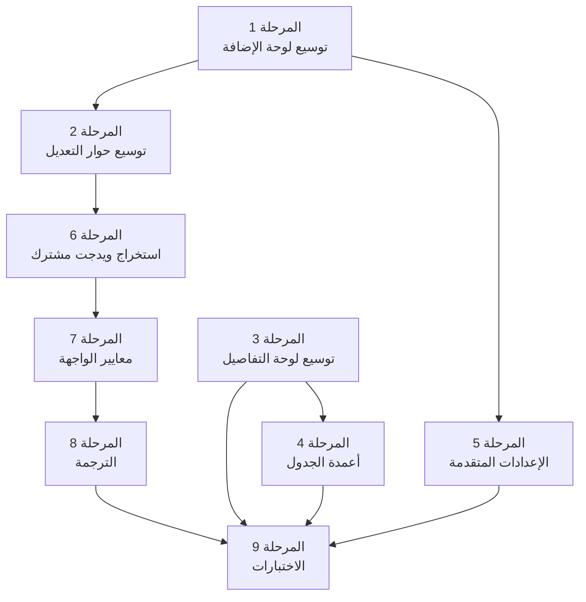

# 📋 الخطة التنفيذية: تغطية حقول CustomFieldEntity بالكامل

> **التاريخ**: 2026-07-31
> **الميزة**: Custom Fields Settings
> **الهدف**: سد الفجوة بين حقول الكيان (Entity) والواجهة (UI) بحيث يتمكن المستخدم من إدارة **جميع** خصائص الحقل المخصص من الواجهة.

---

## 📊 تحليل الوضع الحالي

### الحقول المغطاة بالواجهة ✅
| الحقل | الأزرار التي تتعامل معه |
|---|---|
| `name` | Add, Edit |
| `fieldType` | Add, Edit, Replace (قراءة) |
| `defaultValue` | Add, Edit |
| `visibility` | FieldTableRow (toggle show/hide) |
| `accessControl` | Make private, Make public |
| `orderIndex` | Drag & Drop (Reorder) |

### الحقول غير المغطاة بالواجهة ❌
| # | الحقل | النوع | القيمة الافتراضية |
|---|---|---|---|
| 1 | `emptyValue` | `String?` | `null` |
| 2 | `canBeEmpty` | `bool` | `true` |
| 3 | `fieldMode` | `String` | `'ownedField'` |
| 4 | `valueMode` | `String` | `'single'` |
| 5 | `aliases` | `List<String>?` | `null` |
| 6 | `visibleTo` | `List<String>?` | `null` |
| 7 | `updatableBy` | `List<String>?` | `null` |
| 8 | `showOnlyWhen` | `String?` | `null` |
| 9 | `filterValuesBasedOn` | `String?` | `null` |

---

## 🎯 استراتيجية التنفيذ

بدلاً من إنشاء أزرار منفصلة لكل حقل، سنتبع استراتيجية **تجميع الحقول حسب السياق** في أقسام منطقية داخل:
1. **لوحة الإضافة** (Add Panel) — توسيعها بحقول إضافية
2. **حوار التعديل** (Edit Dialog) — توسيعه بحقول إضافية
3. **لوحة التفاصيل** (Details Panel) — عرض جميع الحقول
4. **الجدول** (Table) — إضافة أعمدة اختيارية

---

## 📦 المرحلة 1: توسيع لوحة الإضافة (Add Panel)

### 📌 الهدف
إضافة الحقول الناقصة إلى لوحة `_buildAddFieldPanel` حتى يتمكن المستخدم من تعبئتها عند إنشاء حقل جديد.

### 📝 الملفات المتأثرة

#### [MODIFY] [custom_fields_settings_section.dart](file:///home/osmsoftwareengineering/flutter_projects/you_track/lib/features/custom_fields/presentation/pages/custom_fields_settings_section.dart)

**التعديلات في `_buildAddFieldPanel` (سطر 385-484)**:

1. **إضافة حقل `emptyValue`**:
   - `TextField` اختياري
   - Label: "القيمة عند الفراغ (اختياري)"
   - يظهر أسفل `defaultValue`

2. **إضافة حقل `canBeEmpty`**:
   - `SwitchListTile` أو `CheckboxListTile`
   - Label: "يمكن أن يكون فارغاً"
   - القيمة الافتراضية: `true`

3. **إضافة حقل `valueMode`**:
   - `DropdownButtonFormField<String>` بقيمتين: `'single'` / `'multi'`
   - Label: "وضع القيمة"
   - يظهر بعد `fieldType`

4. **إضافة حقل `aliases`**:
   - `TextField` مع دعم إدخال متعدد (فاصلة بين القيم)
   - Label: "الأسماء البديلة (اختياري، مفصولة بفاصلة)"

**التعديلات في `State`**:
```dart
// إضافة Controllers و State variables جديدة
final _emptyValueController = TextEditingController();
bool _canBeEmpty = true;
String _valueMode = 'single';
final _aliasesController = TextEditingController();
```

**التعديلات في `_submitAddField` (سطر 755-784)**:
- تمرير الحقول الجديدة إلى `CustomFieldsCubit.addField()`

**التعديلات في `dispose` (سطر 786-791)**:
- إضافة `_emptyValueController.dispose()` و `_aliasesController.dispose()`

---

#### [MODIFY] [custom_fields_cubit.dart](file:///home/osmsoftwareengineering/flutter_projects/you_track/lib/features/custom_fields/presentation/cubits/custom_fields_cubit.dart)

**التعديلات في `addField` (سطر 87-123)**:
- إضافة parameters جديدة: `emptyValue`, `canBeEmpty`, `valueMode`, `aliases`
- تمريرها إلى `_addFieldUseCase`

**التعديلات في `updateField` (سطر 125-162)**:
- إضافة نفس الـ parameters

---

#### [MODIFY] [add_custom_field_use_case.dart](file:///home/osmsoftwareengineering/flutter_projects/you_track/lib/features/custom_fields/domain/usecases/add_custom_field_use_case.dart)

- توسيع `AddCustomFieldParams` بالحقول الجديدة

#### [MODIFY] [update_custom_field_use_case.dart](file:///home/osmsoftwareengineering/flutter_projects/you_track/lib/features/custom_fields/domain/usecases/update_custom_field_use_case.dart)

- توسيع `UpdateCustomFieldParams` بالحقول الجديدة

#### [MODIFY] [custom_fields_repository.dart](file:///home/osmsoftwareengineering/flutter_projects/you_track/lib/features/custom_fields/domain/repositories/custom_fields_repository.dart)

- توسيع `addField()` و `updateField()` بالـ parameters الجديدة

#### [MODIFY] [custom_fields_repository_impl.dart](file:///home/osmsoftwareengineering/flutter_projects/you_track/lib/features/custom_fields/data/repositories/custom_fields_repository_impl.dart)

- تحديث التنفيذ ليشمل الحقول الجديدة

---

## 📦 المرحلة 2: توسيع حوار التعديل (Edit Dialog)

### 📌 الهدف
إضافة نفس الحقول الجديدة إلى `_showEditFieldDialog` حتى يتمكن المستخدم من تعديلها.

### 📝 الملفات المتأثرة

#### [MODIFY] [custom_fields_settings_section.dart](file:///home/osmsoftwareengineering/flutter_projects/you_track/lib/features/custom_fields/presentation/pages/custom_fields_settings_section.dart)

**التعديلات في `_showEditFieldDialog` (سطر 545-647)**:

1. **إضافة `emptyValue`**:
   - `TextField` مُعبّأ بـ `field.emptyValue`

2. **إضافة `canBeEmpty`**:
   - `SwitchListTile` مُعبّأ بـ `field.canBeEmpty`

3. **إضافة `valueMode`**:
   - `DropdownButtonFormField` مُعبّأ بـ `field.valueMode`

4. **إضافة `aliases`**:
   - `TextField` مُعبّأ بـ `field.aliases?.join(', ')`

5. **تمرير القيم الجديدة** في `onPressed` الخاص بزر "Save":
   ```dart
   context.read<CustomFieldsCubit>().updateField(
     fieldId: field.id,
     name: name,
     fieldType: selectedType,
     defaultValue: selectedDefault,
     emptyValue: emptyValueController.text.trim().isEmpty
         ? null
         : emptyValueController.text.trim(),
     canBeEmpty: canBeEmpty,
     valueMode: valueMode,
     aliases: aliasesController.text.trim().isEmpty
         ? null
         : aliasesController.text.split(',').map((e) => e.trim()).toList(),
   );
   ```

> [!TIP]
> يُفضّل استخراج الحقول المشتركة بين Add و Edit إلى ويدجت مشترك (`CustomFieldFormFields`) لتجنب التكرار (DRY Principle).

---

## 📦 المرحلة 3: توسيع لوحة التفاصيل (Details Panel)

### 📌 الهدف
عرض **جميع** حقول الكيان في لوحة التفاصيل الجانبية.

### 📝 الملفات المتأثرة

#### [MODIFY] [custom_field_details_panel.dart](file:///home/osmsoftwareengineering/flutter_projects/you_track/lib/features/custom_fields/presentation/widgets/custom_field_details_panel.dart)

**التعديلات في `build` (سطر 49-66)**:

إضافة صفوف جديدة:
```dart
_buildDetailRow('Field Mode', field.fieldMode, textTheme, colors),
_buildDetailRow('Value Mode', field.valueMode, textTheme, colors),
_buildDetailRow('Aliases', field.aliases?.join(', ') ?? 'None', textTheme, colors),
_buildDetailRow('Visible To', field.visibleTo?.join(', ') ?? 'Everyone', textTheme, colors),
_buildDetailRow('Updatable By', field.updatableBy?.join(', ') ?? 'Everyone', textTheme, colors),
_buildDetailRow('Show Only When', field.showOnlyWhen ?? 'Always', textTheme, colors),
_buildDetailRow('Filter Values Based On', field.filterValuesBasedOn ?? 'None', textTheme, colors),
_buildDetailRow('Order Index', field.orderIndex.toString(), textTheme, colors),
```

> [!TIP]
> يُفضّل تجميع الصفوف في أقسام بعناوين (Sections) لتحسين القراءة:
> - **عام**: Name, Type, Field Mode, Value Mode
> - **القيم**: Default Value, Empty Value, Can Be Empty
> - **الوصول**: Visibility, Access Control, Visible To, Updatable By
> - **متقدم**: Aliases, Show Only When, Filter Values Based On
> - **نظام**: Order Index, Created At, Updated At

---

## 📦 المرحلة 4: إضافة أعمدة اختيارية للجدول

### 📌 الهدف
إضافة أعمدة جديدة في الجدول تظهر عند تفعيل `showDetails`.

### 📝 الملفات المتأثرة

#### [MODIFY] [field_table_header.dart](file:///home/osmsoftwareengineering/flutter_projects/you_track/lib/features/custom_fields/presentation/widgets/field_table_header.dart)

**التعديلات في `build` (سطر 61-76)**:

إضافة أعمدة داخل `if (showDetails)`:
```dart
// العمود الحالي: Empty Value ✅ (موجود)
// العمود الحالي: Default Visibility ✅ (موجود)
// أعمدة جديدة:
Expanded(flex: 1, child: Text('Can Be Empty', ...)),
Expanded(flex: 2, child: Text('Value Mode', ...)),
```

#### [MODIFY] [field_table_row.dart](file:///home/osmsoftwareengineering/flutter_projects/you_track/lib/features/custom_fields/presentation/widgets/field_table_row.dart)

**التعديلات في `build` (سطر 78-106)**:

إضافة خلايا داخل `if (showDetails)`:
```dart
Expanded(
  flex: 1,
  child: Icon(
    field.canBeEmpty ? Icons.check_circle : Icons.cancel,
    size: 16,
    color: field.canBeEmpty ? colors.primary : colors.error,
  ),
),
Expanded(
  flex: 2,
  child: Text(
    field.valueMode == 'single' ? 'Single' : 'Multi',
    style: textTheme.bodySmall,
  ),
),
```

---

## 📦 المرحلة 5: إضافة أزرار متقدمة للتحكم بالوصول

### 📌 الهدف
إضافة واجهات لإدارة الحقول المتقدمة: `visibleTo`, `updatableBy`, `showOnlyWhen`, `filterValuesBasedOn`.

### 📝 الملفات المتأثرة

#### [NEW] advanced_field_settings_dialog.dart
**المسار**: `lib/features/custom_fields/presentation/widgets/advanced_field_settings_dialog.dart`

```
حوار (Dialog) يحتوي على أربعة أقسام:

1. Visible To (من يمكنه الرؤية)
   - MultiSelect Chips لاختيار المجموعات/المستخدمين
   - يقرأ/يكتب: field.visibleTo

2. Updatable By (من يمكنه التعديل)
   - MultiSelect Chips لاختيار المجموعات/المستخدمين
   - يقرأ/يكتب: field.updatableBy

3. Show Only When (شرط العرض)
   - TextField أو Dropdown بالشروط المتاحة
   - يقرأ/يكتب: field.showOnlyWhen

4. Filter Values Based On (فلترة القيم بناء على)
   - Dropdown بقائمة الحقول الأخرى في المشروع
   - يقرأ/يكتب: field.filterValuesBasedOn
```

#### [MODIFY] [custom_fields_settings_section.dart](file:///home/osmsoftwareengineering/flutter_projects/you_track/lib/features/custom_fields/presentation/pages/custom_fields_settings_section.dart)

**التعديلات في `_buildToolbar` (سطر 119-199)**:
- إضافة زر `Advanced Settings` بعد `Make public`:
```dart
OutlinedButton.icon(
  onPressed: hasSelection && _selectedFieldIds.length == 1
      ? _showAdvancedSettings
      : null,
  icon: const Icon(Icons.settings_outlined, size: 18),
  label: const Text('Advanced'),
),
```

**إضافة دالة جديدة**:
```dart
void _showAdvancedSettings() {
  if (_selectedFieldIds.length != 1) return;
  final state = context.read<CustomFieldsCubit>().state;
  if (state is CustomFieldsLoaded) {
    final field = state.fields.firstWhere(
      (f) => f.id == _selectedFieldIds.first,
    );
    showDialog(
      context: context,
      builder: (context) => AdvancedFieldSettingsDialog(field: field),
    );
  }
}
```

---

#### [NEW] update_advanced_field_settings_use_case.dart
**المسار**: `lib/features/custom_fields/domain/usecases/update_advanced_field_settings_use_case.dart`

- `UseCase` جديد يحتوي على Params:
  - `fieldId`
  - `visibleTo`
  - `updatableBy`
  - `showOnlyWhen`
  - `filterValuesBasedOn`

#### [MODIFY] [custom_fields_repository.dart](file:///home/osmsoftwareengineering/flutter_projects/you_track/lib/features/custom_fields/domain/repositories/custom_fields_repository.dart)

- إضافة دالة:
```dart
Future<Either<Failure, CustomFieldEntity>> updateAdvancedSettings({
  required String fieldId,
  List<String>? visibleTo,
  List<String>? updatableBy,
  String? showOnlyWhen,
  String? filterValuesBasedOn,
});
```

#### [MODIFY] [custom_fields_repository_impl.dart](file:///home/osmsoftwareengineering/flutter_projects/you_track/lib/features/custom_fields/data/repositories/custom_fields_repository_impl.dart)

- تنفيذ الدالة الجديدة

#### [MODIFY] [custom_fields_cubit.dart](file:///home/osmsoftwareengineering/flutter_projects/you_track/lib/features/custom_fields/presentation/cubits/custom_fields_cubit.dart)

- إضافة دالة:
```dart
Future<void> updateAdvancedSettings({
  required String fieldId,
  List<String>? visibleTo,
  List<String>? updatableBy,
  String? showOnlyWhen,
  String? filterValuesBasedOn,
}) async { ... }
```

---

## 📦 المرحلة 6: استخراج ويدجت مشترك (Refactoring)

### 📌 الهدف
تطبيق مبدأ DRY بين لوحة الإضافة وحوار التعديل.

### 📝 الملفات المتأثرة

#### [NEW] custom_field_form_fields.dart
**المسار**: `lib/features/custom_fields/presentation/widgets/custom_field_form_fields.dart`

ويدجت `StatelessWidget` يحتوي على:
- `TextField` لـ `name`
- `DropdownButtonFormField` لـ `fieldType`
- `DropdownButtonFormField` لـ `valueMode`
- `TextField` لـ `defaultValue`
- `TextField` لـ `emptyValue`
- `SwitchListTile` لـ `canBeEmpty`
- `TextField` لـ `aliases`

**المدخلات**:
```dart
class CustomFieldFormFields extends StatelessWidget {
  final TextEditingController nameController;
  final CustomFieldEnumType selectedType;
  final ValueChanged<CustomFieldEnumType> onTypeChanged;
  final String valueMode;
  final ValueChanged<String> onValueModeChanged;
  final TextEditingController defaultValueController;
  final TextEditingController emptyValueController;
  final bool canBeEmpty;
  final ValueChanged<bool> onCanBeEmptyChanged;
  final TextEditingController aliasesController;
  ...
}
```

#### [MODIFY] [custom_fields_settings_section.dart](file:///home/osmsoftwareengineering/flutter_projects/you_track/lib/features/custom_fields/presentation/pages/custom_fields_settings_section.dart)

- استبدال الحقول في `_buildAddFieldPanel` و `_showEditFieldDialog` بـ `CustomFieldFormFields`

---

## 📦 المرحلة 7: تطبيق معايير الواجهة (UI Standards)

### 📌 الهدف
مطابقة الكود مع قواعد الـ UI Standards المعتمدة في المشروع.

### 📝 المهام

| المعيار | الحالة الحالية | المطلوب |
|---|---|---|
| **النصوص** | Hardcoded strings مباشرة (`'Add field to project ...'`, `'Edit'`, إلخ) | استخدام `AppLocalizations` |
| **الأيقونات** | `Icons.add`, `Icons.edit_outlined`, إلخ مباشرة | استخدام `AppIcons` |
| **الألوان** | `Colors.white` في `_buildAddFieldPanel` | استخدام `Theme.of(context).colorScheme` |
| **المسافات** | بعض القيم مباشرة (`16.0`, `4`, `8`) | استخدام `AppSpacing` |
| **الحواف** | `BorderRadius.circular(8)`, `BorderRadius.circular(4)` | استخدام `AppRadius` |
| **الأحجام** | بعض القيم مباشرة (`size: 18`, `size: 20`, `width: 400`) | استخدام `AppSizes` |
| **أنماط النصوص** | `TextStyle(fontSize: 20, fontWeight: FontWeight.bold)` | استخدام `AppTextTheme` |

### 📝 الملفات المتأثرة
- جميع ملفات الـ Presentation في الميزة

---

## 📦 المرحلة 8: إضافة الترجمة (Localization)

### 📌 الهدف
إضافة جميع النصوص الجديدة إلى ملفات الترجمة العربية والإنجليزية.

### 📝 المفاتيح المطلوبة

```
customFieldsAddFieldToProject → "Add field to project ..." / "إضافة حقل للمشروع ..."
customFieldsEditField → "Edit Custom Field" / "تعديل حقل مخصص"
customFieldsDeleteFields → "Delete Custom Fields" / "حذف حقول مخصصة"
customFieldsEmptyValue → "Empty value (optional)" / "القيمة عند الفراغ (اختياري)"
customFieldsCanBeEmpty → "Can be empty" / "يمكن أن يكون فارغاً"
customFieldsValueMode → "Value mode" / "وضع القيمة"
customFieldsValueModeSingle → "Single" / "مفرد"
customFieldsValueModeMulti → "Multi" / "متعدد"
customFieldsAliases → "Aliases (optional, comma-separated)" / "الأسماء البديلة (اختياري، مفصولة بفاصلة)"
customFieldsFieldMode → "Field mode" / "وضع الحقل"
customFieldsVisibleTo → "Visible to" / "مرئي لـ"
customFieldsUpdatableBy → "Updatable by" / "قابل للتعديل بواسطة"
customFieldsShowOnlyWhen → "Show only when" / "يظهر فقط عندما"
customFieldsFilterValuesBasedOn → "Filter values based on" / "فلترة القيم بناء على"
customFieldsAdvancedSettings → "Advanced settings" / "إعدادات متقدمة"
customFieldsNoCustomFieldsYet → "No custom fields yet" / "لا توجد حقول مخصصة بعد"
customFieldsFieldDetails → "Field Details" / "تفاصيل الحقل"
customFieldsMakePublicSuccess → "Field is now visible to everyone" / "الحقل مرئي للجميع الآن"
customFieldsAccessControlUpdated → "Access control updated" / "تم تحديث التحكم بالوصول"
customFieldsSelected → "{count} selected" / "{count} محدد"
customFieldsDeleteConfirmation → "Are you sure you want to delete {count} custom field(s)?" / "هل أنت متأكد من حذف {count} حقل مخصص؟"
```

### 📝 الملفات المتأثرة
- `lib/core/localization/arb/app_ar.arb`
- `lib/core/localization/arb/app_en.arb`

---

## 📦 المرحلة 9: الفحص والاختبارات

### 📌 الاختبارات المطلوبة

#### اختبارات وحدات (Unit Tests)
| الملف | الاختبار |
|---|---|
| `custom_fields_cubit_test.dart` | اختبار `addField` مع الحقول الجديدة |
| `custom_fields_cubit_test.dart` | اختبار `updateField` مع الحقول الجديدة |
| `custom_fields_cubit_test.dart` | اختبار `updateAdvancedSettings` |

#### اختبارات ويدجت (Widget Tests)
| الملف | الاختبار |
|---|---|
| `custom_field_form_fields_test.dart` | التحقق من ظهور جميع الحقول |
| `advanced_field_settings_dialog_test.dart` | التحقق من حفظ الإعدادات المتقدمة |
| `custom_field_details_panel_test.dart` | التحقق من عرض جميع الحقول |

---

## 📊 ملخص الملفات

### ملفات جديدة (3 ملفات)
| # | الملف | الوصف |
|---|---|---|
| 1 | `advanced_field_settings_dialog.dart` | حوار الإعدادات المتقدمة |
| 2 | `custom_field_form_fields.dart` | ويدجت مشترك للنموذج |
| 3 | `update_advanced_field_settings_use_case.dart` | حالة استخدام جديدة |

### ملفات معدّلة (11 ملف)
| # | الملف | نوع التعديل |
|---|---|---|
| 1 | `custom_fields_settings_section.dart` | إضافة حقول + زر Advanced + استخراج ويدجت |
| 2 | `custom_fields_cubit.dart` | إضافة parameters + دالة جديدة |
| 3 | `custom_field_details_panel.dart` | عرض جميع الحقول |
| 4 | `field_table_header.dart` | أعمدة جديدة |
| 5 | `field_table_row.dart` | خلايا جديدة |
| 6 | `add_custom_field_use_case.dart` | توسيع Params |
| 7 | `update_custom_field_use_case.dart` | توسيع Params |
| 8 | `custom_fields_repository.dart` | دالة جديدة |
| 9 | `custom_fields_repository_impl.dart` | تنفيذ الدالة الجديدة |
| 10 | `app_ar.arb` | مفاتيح ترجمة |
| 11 | `app_en.arb` | مفاتيح ترجمة |

---

## ⏱️ ترتيب التنفيذ (التبعيات)



> [!IMPORTANT]
> **التبعيات الحرجة**:
> - المرحلة 6 (Refactoring) تعتمد على إكمال المرحلتين 1 و 2
> - المرحلة 8 (الترجمة) تعتمد على إكمال المرحلة 7
> - المرحلة 9 (الاختبارات) هي المرحلة الأخيرة دائماً
> - المراحل 3 و 4 يمكن تنفيذها بالتوازي مع 1 و 2

---

## 🔗 المهارات والأدوات المطلوبة

| المهارة / Workflow | الاستخدام |
|---|---|
| `/add_localization_text` | إضافة مفاتيح الترجمة (المرحلة 8) |
| `/add_use_case` | إنشاء UseCase جديد (المرحلة 5) |
| `/add_repository_interface` | تعديل واجهة المستودع (المرحلة 5) |
| `/add_repository_implementation` | تعديل تنفيذ المستودع (المرحلة 5) |
| `فحص الوحدات (Unit Test)` | كتابة الاختبارات (المرحلة 9) |
| `فحص الواجهات (Widget Test)` | كتابة اختبارات الويدجت (المرحلة 9) |

---

## 📐 مخطط المصفوفة النهائية (بعد التنفيذ)

| الحقل ↓ / الزر → | Add | Edit | Delete | Replace | Private | Public | Visibility | Reorder | Details | Advanced |
|---|:---:|:---:|:---:|:---:|:---:|:---:|:---:|:---:|:---:|:---:|
| `id` | — | **R** | **R** | **R** | **R** | **R** | — | — | **R** | **R** |
| `projectId` | **W** | — | — | — | — | — | — | **R** | — | — |
| `name` | **W** | **W** | — | — | — | — | — | — | **R** | — |
| `fieldType` | **W** | **W** | — | **R** | — | — | — | — | **R** | — |
| `fieldMode` | — | — | — | — | — | — | — | — | **R** | — |
| `valueMode` | **W** 🆕 | **W** 🆕 | — | — | — | — | — | — | **R** | — |
| `defaultValue` | **W** | **W** | — | — | — | — | — | — | **R** | — |
| `emptyValue` | **W** 🆕 | **W** 🆕 | — | — | — | — | — | — | **R** | — |
| `canBeEmpty` | **W** 🆕 | **W** 🆕 | — | — | — | — | — | — | **R** | — |
| `aliases` | **W** 🆕 | **W** 🆕 | — | — | — | — | — | — | **R** | — |
| `visibleTo` | — | — | — | — | — | — | — | — | **R** | **W** 🆕 |
| `updatableBy` | — | — | — | — | — | — | — | — | **R** | **W** 🆕 |
| `showOnlyWhen` | — | — | — | — | — | — | — | — | **R** | **W** 🆕 |
| `filterValuesBasedOn` | — | — | — | — | — | — | — | — | **R** | **W** 🆕 |
| `visibility` | — | — | — | — | — | — | **W** | — | **R** | — |
| `accessControl` | — | — | — | — | **W** | **W** | — | — | **R** | — |
| `orderIndex` | — | — | — | — | — | — | — | **W** | **R** 🆕 | — |
| `createdAt` | — | — | — | — | — | — | — | — | **R** | — |
| `updatedAt` | — | — | — | — | — | — | — | — | **R** | — |

> **R** = يقرأ | **W** = يكتب | 🆕 = جديد في الخطة | **—** = لا علاقة

> [!NOTE]
> بعد تنفيذ الخطة، سيكون **كل حقل** في `CustomFieldEntity` مغطى بالقراءة أو الكتابة من الواجهة.
