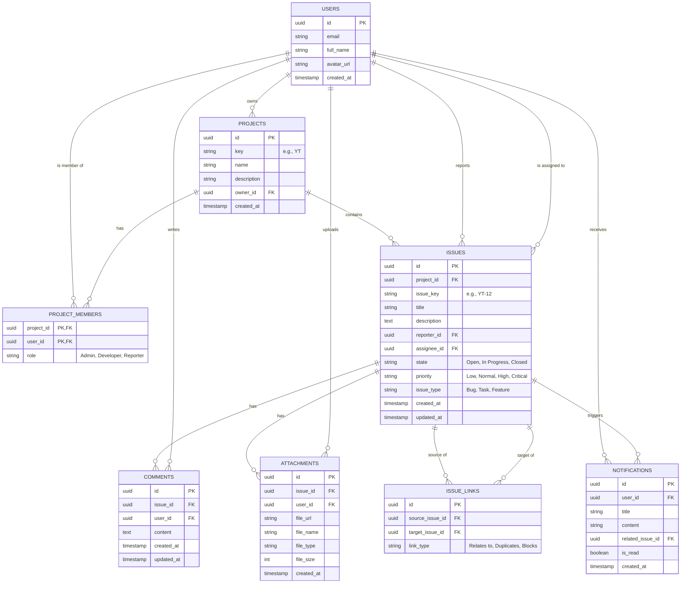

# مخطط الكيانات والعلاقات (ERD) لمشروع issues_tracking

هذا المستند يعرض الهيكلية المنطقية لقاعدة بيانات النظام، المعتمدة على PostgreSQL عبر Supabase.

## 📊 مخطط Mermaid

## 📝 تفاصيل الجداول والعلاقات

1. **USERS (المستخدمون):** يخزن بيانات المستخدمين الأساسية (تتكامل مع Supabase Auth).
2. **PROJECTS (المشاريع):** المشاريع التي تحتوي على المهام، ولكل مشروع مفتاح فريد `key` يستخدم لتوليد أرقام المشاكل (مثل `YT-1`, `YT-2`).
3. **PROJECT_MEMBERS (أعضاء المشاريع):** جدول ربط (Many-to-Many) بين المستخدمين والمشاريع لتحديد صلاحية كل مستخدم (Role) داخل المشروع المعين.
4. **ISSUES (المشاكل/المهام):** الكيان الرئيسي في النظام. يرتبط بالمشروع، والمُبلّغ، والمعيّن له، ويحتوي على بيانات الحالة والأولوية. يتم حساب `issue_key` برمجياً أو باستخدام Sequence/Trigger.
5. **COMMENTS (التعليقات):** تعليقات المستخدمين على مشكلة معينة.
6. **ATTACHMENTS (المرفقات):** الملفات المرفوعة لمشكلة معينة، تخزن الروابط (URL) التي تشير إلى Supabase Storage.
7. **ISSUE_LINKS (روابط المشاكل):** علاقة المشاكل ببعضها (Self-referencing)، مثل تحديد مشكلة تمنع (Blocks) مشكلة أخرى.
8. **NOTIFICATIONS (الإشعارات):** تسجيل الإشعارات المرسلة للمستخدمين سواء كانت مقروءة أم لا.
