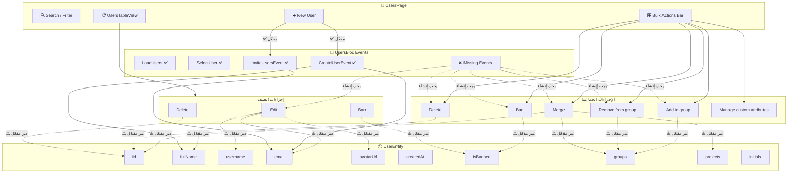

# 🔍 تحليل أزرار واجهة المستخدمين وربطها بـ UserEntity

## 📦 حقول UserEntity (ميزة Users)

| # | الحقل | النوع | مطلوب؟ | الوصف |
|---|-------|-------|--------|-------|
| 1 | `id` | `String` | ✅ | معرّف المستخدم الفريد |
| 2 | `fullName` | `String` | ✅ | الاسم الكامل |
| 3 | `username` | `String` | ✅ | اسم المستخدم |
| 4 | `email` | `String` | ✅ | البريد الإلكتروني |
| 5 | `avatarUrl` | `String?` | ❌ | رابط الصورة الشخصية |
| 6 | `createdAt` | `DateTime?` | ❌ | تاريخ التسجيل |
| 7 | `isBanned` | `bool` | ❌ | حالة الحظر (افتراضي `false`) |
| 8 | `groups` | `List<String>` | ❌ | المجموعات التي ينتمي لها |
| 9 | `projects` | `List<String>` | ❌ | المشاريع المرتبطة به |
| 10 | `initials` | `String` | ❌ | الأحرف الأولى للعرض في الـ Avatar |

---

## 🎛️ جرد جميع الأزرار وتحليلها

### 1️⃣ شريط أدوات الإجراءات الجماعية (Bulk Actions Bar)

هذه الأزرار تعمل على **مستخدم واحد أو أكثر محددين** من الجدول:

#### 🔹 `Add to group` (Dropdown)
| البند | التفاصيل |
|-------|---------|
| **النوع** | `_buildDropdownButton` — زر مع سهم dropdown |
| **الحقل المتأثر** | `groups` → إضافة عنصر جديد إلى القائمة |
| **السيناريو المتوقع** | تحديد مستخدمين ← فتح قائمة المجموعات ← اختيار مجموعة ← إضافتها إلى `groups` لكل مستخدم محدد |
| **حالة التنفيذ** | ⚠️ **غير مفعّل** — لا يوجد `onTap`/`onPressed`، ولا يوجد Event مناظر في [users_event.dart](file:///home/osmsoftwareengineering/flutter_projects/you_track/lib/features/users/presentation/bloc/users_event.dart) |

#### 🔹 `Remove from group` (Dropdown)
| البند | التفاصيل |
|-------|---------|
| **النوع** | `_buildDropdownButton` — زر مع سهم dropdown |
| **الحقل المتأثر** | `groups` → إزالة عنصر من القائمة |
| **السيناريو المتوقع** | تحديد مستخدمين ← فتح قائمة مجموعاتهم المشتركة ← اختيار مجموعة ← إزالتها من `groups` |
| **حالة التنفيذ** | ⚠️ **غير مفعّل** — نفس المشكلة |

#### 🔹 `Ban` (Action)
| البند | التفاصيل |
|-------|---------|
| **النوع** | `_buildActionButton` — زر إجراء بسيط |
| **الحقل المتأثر** | `isBanned` → تغيير القيمة إلى `true` |
| **السيناريو المتوقع** | تحديد مستخدمين ← الضغط Ban ← تأكيد ← تحديث `isBanned = true` ← ظهور شارة "banned" بجانب الاسم |
| **حالة التنفيذ** | ⚠️ **غير مفعّل** — لا يوجد `onTap`، ولا يوجد Event مناظر |

#### 🔹 `Merge` (Action)
| البند | التفاصيل |
|-------|---------|
| **النوع** | `_buildActionButton` — زر إجراء بسيط |
| **الحقول المتأثرة** | **جميع الحقول** — يدمج حسابين في حساب واحد |
| **السيناريو المتوقع** | تحديد مستخدمَين بالضبط ← اختيار الحساب الأساسي ← نقل `groups` و `projects` من الحساب الثانوي ← حذف الحساب الثانوي |
| **حالة التنفيذ** | ⚠️ **غير مفعّل** |

#### 🔹 `Delete` (Action)
| البند | التفاصيل |
|-------|---------|
| **النوع** | `_buildActionButton` — زر إجراء بسيط |
| **الحقل المتأثر** | حذف الكائن بالكامل بناءً على `id` |
| **السيناريو المتوقع** | تحديد مستخدمين ← الضغط Delete ← تأكيد ← حذف المستخدمين من القائمة |
| **حالة التنفيذ** | ⚠️ **غير مفعّل** |

#### 🔹 `Manage custom attributes` (TextButton)
| البند | التفاصيل |
|-------|---------|
| **النوع** | `TextButton` — رابط نصي |
| **الحقل المتأثر** | **لا يوجد حقل حالياً** — يتطلب إضافة `customAttributes: Map<String, dynamic>?` إلى الكينونة |
| **السيناريو المتوقع** | فتح صفحة/Dialog لإدارة السمات المخصصة (مثل: الرقم الوظيفي، القسم، إلخ) |
| **حالة التنفيذ** | ⚠️ **غير مفعّل** — `onPressed: () {}` |

---

### 2️⃣ زر إنشاء مستخدم جديد

#### 🔹 `New User` (FilledButton.icon)
| البند | التفاصيل |
|-------|---------|
| **الموقع** | [users_page.dart L88-L92](file:///home/osmsoftwareengineering/flutter_projects/you_track/lib/features/users/presentation/pages/users_page.dart#L88-L92) |
| **الحقول المتأثرة** | `fullName`, `email` + (password خارج الكينونة) |
| **السيناريو** | الضغط ← فتح [new_user_dialog.dart](file:///home/osmsoftwareengineering/flutter_projects/you_track/lib/features/users/presentation/pages/new_user_dialog.dart) ← اختيار Invite أو Create ← إرسال Event |
| **حالة التنفيذ** | ✅ **مفعّل** — يفتح Dialog ويُرسل `CreateUserEvent` أو `InviteUsersEvent` |

---

### 3️⃣ أزرار صف المستخدم (Per-Row Actions)

في [user_table_row.dart](file:///home/osmsoftwareengineering/flutter_projects/you_track/lib/features/users/presentation/widgets/user_table_row.dart) يوجد `PopupMenuButton` لكل صف:

| الخيار | الحقل المتأثر | حالة التنفيذ |
|--------|--------------|--------------|
| `Edit` | `fullName`, `username`, `email`, `avatarUrl` | ⚠️ غير مفعّل — لا يوجد Handler |
| `Delete` | حذف بالـ `id` | ⚠️ غير مفعّل |
| `Ban` | `isBanned` → `true` | ⚠️ غير مفعّل |

---

## 🔄 مخطط تدفق العمل الكامل

---

## 📊 مصفوفة الربط: الأزرار ↔ حقول الكينونة

| الزر | `id` | `fullName` | `username` | `email` | `avatarUrl` | `createdAt` | `isBanned` | `groups` | `projects` | `initials` |
|------|:----:|:----------:|:----------:|:-------:|:-----------:|:-----------:|:----------:|:--------:|:----------:|:----------:|
| Add to group | 🔑 | | | | | | | ✏️ | | |
| Remove from group | 🔑 | | | | | | | ✏️ | | |
| Ban | 🔑 | | | | | | ✏️ | | | |
| Merge | 🔑🔑 | 🔀 | 🔀 | 🔀 | 🔀 | | | 🔀 | 🔀 | 🔀 |
| Delete | 🔑 | 🗑️ | 🗑️ | 🗑️ | 🗑️ | 🗑️ | 🗑️ | 🗑️ | 🗑️ | 🗑️ |
| New User (Create) | 🆕 | ✏️ | | ✏️ | | 🆕 | | | | 🆕 |
| New User (Invite) | | | | ✏️ | | | | | | |
| Edit (Row) | 🔑 | ✏️ | ✏️ | ✏️ | ✏️ | | | | | |
| Delete (Row) | 🔑 | 🗑️ | 🗑️ | 🗑️ | 🗑️ | 🗑️ | 🗑️ | 🗑️ | 🗑️ | 🗑️ |
| Ban (Row) | 🔑 | | | | | | ✏️ | | | |
| Manage Attributes | 🔑 | | | | | | | | | |

> **الرموز:** 🔑 = يُستخدم كمفتاح تعريف، ✏️ = يُعدّل الحقل، 🗑️ = يُحذف مع الكائن، 🔀 = يُدمج من حساب آخر، 🆕 = يُنشأ تلقائياً

---

## 🚨 ملخص الفجوات (Gaps)

### فجوات الـ Bloc (Events مفقودة)
جميع الأزرار التالية **لا تملك Event مناظر** في [users_event.dart](file:///home/osmsoftwareengineering/flutter_projects/you_track/lib/features/users/presentation/bloc/users_event.dart):

| Event المطلوب | الزر المرتبط | الحقول المطلوبة |
|--------------|-------------|----------------|
| `AddUserToGroupEvent` | Add to group | `userId`, `groupId` |
| `RemoveUserFromGroupEvent` | Remove from group | `userId`, `groupId` |
| `BanUserEvent` | Ban / Ban (Row) | `userId` |
| `UnbanUserEvent` | (غير موجود بعد) | `userId` |
| `MergeUsersEvent` | Merge | `primaryUserId`, `secondaryUserId` |
| `DeleteUserEvent` | Delete / Delete (Row) | `userId` |
| `EditUserEvent` | Edit (Row) | `userId` + الحقول المعدّلة |

### فجوات الواجهة (UI)
1. **Checkbox التحديد** في [user_table_row.dart L67-L71](file:///home/osmsoftwareengineering/flutter_projects/you_track/lib/features/users/presentation/widgets/user_table_row.dart#L67-L71) — قيمته ثابتة `false` ولا يوجد منطق تحديد متعدد ← الأزرار الجماعية لن تعمل بدونه.
2. **Unban** — لا يوجد زر لإلغاء الحظر، رغم أن `isBanned` يدعم `true/false`.
3. **Manage custom attributes** — لا يوجد حقل `customAttributes` في الكينونة.

### فجوات الكينونة
- حقل `isBanned` موجود ✅ لكن لا يوجد حقل `bannedAt` أو `bannedReason`.
- حقل `groups` هو `List<String>` (أسماء فقط) — قد يحتاج إلى `List<GroupEntity>` للربط الصحيح.
