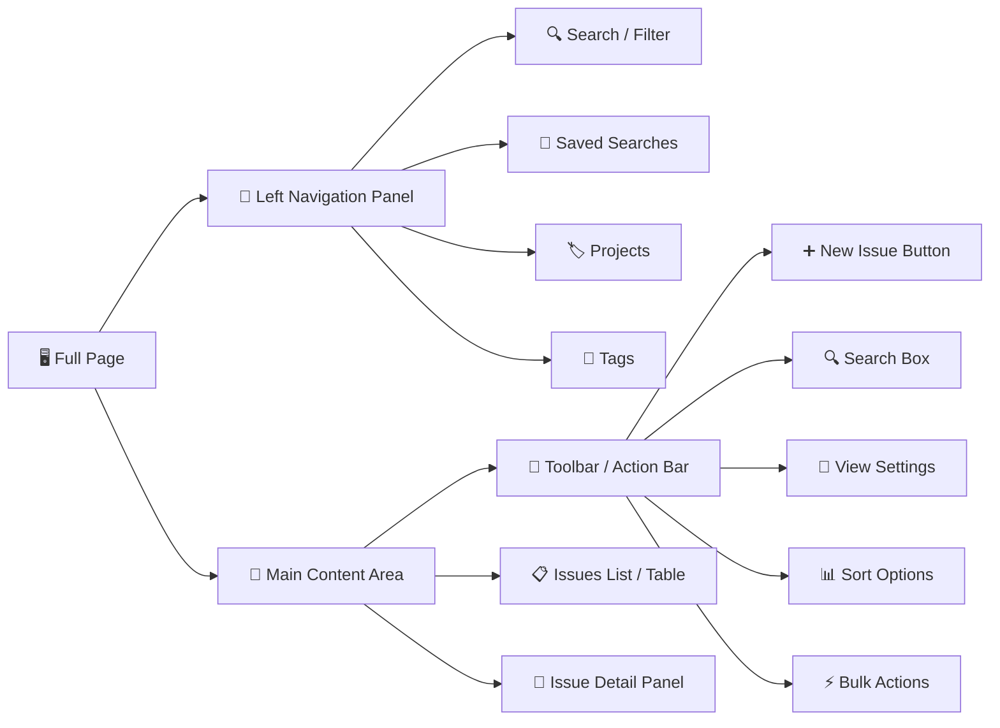
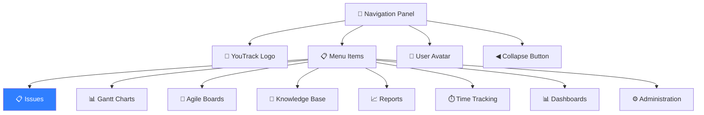
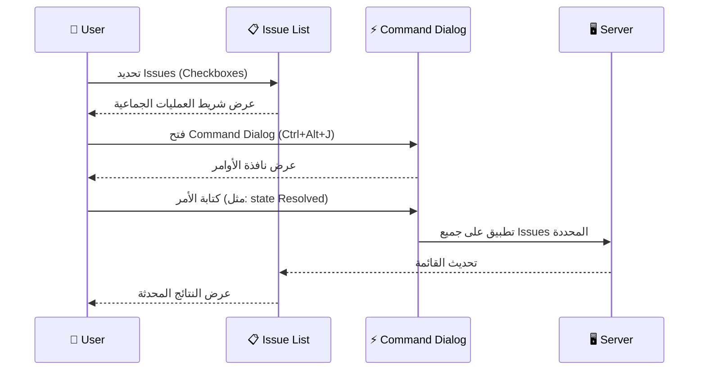
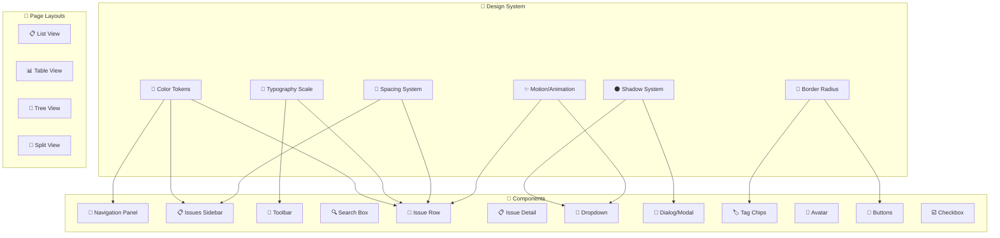

# 📋 تحليل شامل لصفحة Issues في YouTrack

> [!NOTE]
> هذا التحليل مبني على أحدث إصدار من YouTrack (2025/2026) بعد التصميم الموحد الجديد الذي ألغى التقسيم بين الواجهة "Classic" و "Lite".

---

## 📐 1. هيكل الصفحة (Page Layout Structure)



### 1.1 التقسيم العام

| المنطقة | الموقع | العرض التقريبي | الوصف |
|---------|--------|---------------|-------|
| **Navigation Panel** | أقصى اليسار | `56px` (مطوي) / `240px` (مفتوح) | لوحة تنقل رئيسية قابلة للطي |
| **Issues Sidebar** | يسار المحتوى | `~250px` | شريط جانبي للفلاتر والمشاريع والبحث المحفوظ |
| **Main Content** | المنتصف | `flex-grow: 1` | منطقة عرض القائمة/الجدول |
| **Issue Detail** | يمين (اختياري) | `~50%` عند الفتح | تفاصيل الـ Issue المحدد (Split View) |

### 1.2 الهيكل الرأسي للمحتوى الرئيسي

```
┌──────────────────────────────────────────────────┐
│  🔧 Toolbar (Search + Actions + View Controls)   │  ~48px
├──────────────────────────────────────────────────┤
│  📊 Breadcrumb / Hierarchy Path                  │  ~32px
├──────────────────────────────────────────────────┤
│                                                  │
│  📋 Issues List                                  │  flex-grow
│      ┌─────────────────────────────────┐         │
│      │  Issue Row 1                    │         │
│      ├─────────────────────────────────┤         │
│      │  Issue Row 2                    │         │
│      ├─────────────────────────────────┤         │
│      │  Issue Row 3                    │         │
│      ├─────────────────────────────────┤         │
│      │  ...                            │         │
│      └─────────────────────────────────┘         │
│                                                  │
├──────────────────────────────────────────────────┤
│  📄 Pagination / Load More                       │  ~40px
└──────────────────────────────────────────────────┘
```

---

## 🎨 2. التصميم البصري (Visual Design)

### 2.1 نظام الألوان (Color System)

#### الوضع الداكن (Dark Theme) - الافتراضي

| العنصر | اللون | الكود |
|--------|-------|-------|
| **خلفية التنقل** | أسود داكن جداً | `#18191B` |
| **خلفية المحتوى** | رمادي داكن | `#1E1F22` |
| **خلفية الـ Sidebar** | رمادي أغمق | `#2B2D30` |
| **خلفية صف Issue** | شفاف | `transparent` |
| **خلفية Hover** | رمادي فاتح شبه شفاف | `rgba(255,255,255,0.06)` |
| **خلفية Selected** | أزرق شبه شفاف | `rgba(48,127,255,0.12)` |
| **اللون الأساسي (Primary)** | أزرق JetBrains | `#307FFF` |
| **النص الرئيسي** | أبيض مائل للرمادي | `#DFE1E5` |
| **النص الثانوي** | رمادي متوسط | `#868A91` |
| **النص المعطل** | رمادي خافت | `#5A5D63` |
| **الفواصل/الحدود** | رمادي خفيف | `rgba(255,255,255,0.08)` |
| **الأخضر (Resolved)** | أخضر | `#59A869` |
| **الأحمر (Critical)** | أحمر | `#F75464` |
| **البرتقالي (Major)** | برتقالي | `#E8A838` |
| **الأزرق (Normal)** | أزرق فاتح | `#6C9BD2` |

#### الوضع الفاتح (Light Theme)

| العنصر | اللون | الكود |
|--------|-------|-------|
| **خلفية التنقل** | أبيض | `#FFFFFF` |
| **خلفية المحتوى** | أبيض مائل للرمادي | `#F7F8FA` |
| **خلفية الـ Sidebar** | رمادي فاتح | `#F0F1F2` |
| **النص الرئيسي** | أسود | `#27282E` |
| **النص الثانوي** | رمادي | `#6C707E` |
| **خلفية Hover** | رمادي فاتح | `rgba(0,0,0,0.04)` |

### 2.2 الخطوط (Typography)

| العنصر | الخط | الحجم | الوزن | ارتفاع السطر |
|--------|------|-------|-------|-------------|
| **عنوان Issue** | Inter / System | `14px` | `400` (عادي) | `20px` |
| **Issue ID** | JetBrains Mono / Monospace | `13px` | `400` | `18px` |
| **النص الثانوي** | Inter / System | `12px` | `400` | `16px` |
| **Toolbar Labels** | Inter / System | `13px` | `500` (متوسط) | `18px` |
| **Sidebar Headers** | Inter / System | `11px` | `700` (عريض) | `16px` |
| **Tag Chips** | Inter / System | `12px` | `400` | `16px` |
| **عنوان القسم** | Inter / System | `16px` | `600` | `22px` |

### 2.3 المسافات (Spacing)

| العنصر | القيمة |
|--------|--------|
| **padding صف Issue** | `8px 16px` |
| **ارتفاع صف Issue** | `~40px` (Compact) / `~56px` (Comfortable) |
| **الفجوة بين الصفوف** | `0px` (فاصل خط فقط) |
| **padding الـ Toolbar** | `8px 16px` |
| **padding الـ Sidebar** | `12px 16px` |
| **margin بين أقسام Sidebar** | `16px` |
| **فجوة بين العناصر في الصف** | `8px` |
| **padding الـ Tag Chip** | `2px 8px` |

### 2.4 الحدود والزوايا (Borders & Radius)

| العنصر | القيمة |
|--------|--------|
| **فاصل بين الصفوف** | `1px solid rgba(255,255,255,0.06)` |
| **زوايا الأزرار** | `4px` |
| **زوايا Tag Chips** | `4px` |
| **زوايا Avatar** | `50%` (دائري) |
| **زوايا Dropdown** | `6px` |
| **زوايا Search Box** | `6px` |
| **زوايا البطاقات** | `8px` |
| **حدود Search Box** | `1px solid rgba(255,255,255,0.12)` |

### 2.5 الظلال (Shadows)

| العنصر | القيمة |
|--------|--------|
| **Dropdown Menus** | `0 4px 16px rgba(0,0,0,0.4)` |
| **Popups & Modals** | `0 8px 24px rgba(0,0,0,0.5)` |
| **Toolbar (Sticky)** | `0 1px 0 rgba(255,255,255,0.06)` |
| **Navigation Panel** | لا ظل - يعتمد على فارق اللون |

---

## 🧩 3. المكونات التفصيلية (Components)

### 3.1 لوحة التنقل الرئيسية (Navigation Panel)



#### التفاصيل:
- **الحالة المطوية**: عرض `56px`، تظهر الأيقونات فقط
- **الحالة المفتوحة**: عرض `240px`، تظهر الأيقونات + النصوص
- **خلفية العنصر النشط**: `rgba(48,127,255,0.15)` مع شريط أزرق على اليسار بعرض `3px`
- **Hover Effect**: `rgba(255,255,255,0.06)` مع `transition: background 150ms ease`
- **الأيقونات**: `20px × 20px`، لون `#868A91` (رمادي)، نشط `#307FFF` (أزرق)

### 3.2 الشريط الجانبي للفلاتر (Issues Sidebar)

```
┌─────────────────────────────┐
│  🔍 Quick Filters           │
│  ├── Assigned to me         │
│  ├── Reported by me         │
│  ├── Starred                │
│  └── Commented by me        │
├─────────────────────────────┤
│  💾 Saved Searches          │
│  ├── My Open Bugs           │
│  ├── Sprint Backlog         │
│  └── + New saved search     │
├─────────────────────────────┤
│  📂 Projects                │
│  ├── ▶ Project Alpha        │
│  ├── ▶ Project Beta         │
│  └── ▶ Project Gamma        │
├─────────────────────────────┤
│  🏷️ Tags                    │
│  ├── 🟢 Frontend            │
│  ├── 🔵 Backend             │
│  ├── 🟡 Design              │
│  └── 🔴 Urgent              │
└─────────────────────────────┘
```

#### التفاصيل:
- **عنوان القسم**: حروف كبيرة (UPPERCASE)، حجم `11px`، وزن `700`، لون `#868A91`
- **عناصر القائمة**: حجم `13px`، ارتفاع `32px`
- **Hover على العنصر**: خلفية `rgba(255,255,255,0.06)`
- **العنصر النشط**: خلفية `rgba(48,127,255,0.1)`، نص أزرق `#307FFF`
- **عداد Issues**: يظهر يمين كل عنصر، حجم `12px`، لون `#868A91`
- **قابل للسحب والإفلات** (Drag & Drop) لإعادة ترتيب العناصر
- **زر الإخفاء**: أيقونة `«` في الأعلى لطي الـ Sidebar

### 3.3 شريط الأدوات (Toolbar)

```
┌──────────────────────────────────────────────────────────────────┐
│ [➕ New Issue]  🔍[________________________________🔎]  [⚙ ▼]  │
│                    Search box with suggestions        Settings   │
├──────────────────────────────────────────────────────────────────┤
│ 📊 Sort: Updated ▼  |  🔢 Results: 1,247  |  ☑ Select All     │
│ [📋 List] [📊 Table] [🌳 Tree]  |  [⚡ Commands] [📥 Export]  │
└──────────────────────────────────────────────────────────────────┘
```

#### مكونات Toolbar:

##### 3.3.1 زر New Issue
- **النمط**: زر أساسي (Primary Button)
- **اللون**: خلفية `#307FFF`، نص `#FFFFFF`
- **الحجم**: ارتفاع `32px`، padding `0 12px`
- **Hover**: خلفية `#4D94FF`
- **Active/Press**: خلفية `#1A6AFF`
- **الأيقونة**: `+` بحجم `16px` قبل النص
- **Border Radius**: `4px`
- **Transition**: `background 150ms ease`

##### 3.3.2 مربع البحث (Search Box)
- **العرض**: `flex-grow: 1` (يأخذ المساحة المتبقية)
- **الارتفاع**: `32px`
- **الخلفية**: `rgba(255,255,255,0.06)`
- **الحدود**: `1px solid rgba(255,255,255,0.1)`
- **Focus State**: حدود `1px solid #307FFF`، ظل `0 0 0 2px rgba(48,127,255,0.2)`
- **أيقونة البحث**: `🔍` بحجم `16px` على اليسار
- **Placeholder**: "Search issues..." بلون `#868A91`
- **يدعم وضعين**:
  - **Simple**: اقتراحات بلغة طبيعية
  - **Advanced**: لغة استعلام YouTrack (مثلاً `project: Alpha state: Open`)
- **اقتراحات ديناميكية**: Dropdown يظهر أسفل البحث مع اقتراحات

##### 3.3.3 أزرار أوضاع العرض (View Mode Toggle)
- **النمط**: مجموعة أزرار متصلة (Segmented Control)
- **الخلفية**: `rgba(255,255,255,0.04)`
- **الزر النشط**: خلفية `rgba(255,255,255,0.1)`، نص أبيض
- **الزر غير النشط**: نص `#868A91`
- **Border Radius**: `4px` للمجموعة، `0` للأزرار الداخلية
- **الأوضاع**:
  - 📋 **List View**: عرض قائمة بسطر واحد أو أكثر لكل Issue
  - 📊 **Table View**: عرض جدولي مع أعمدة قابلة للتخصيص
  - 🌳 **Tree View**: عرض شجري لعلاقات التبعية

##### 3.3.4 قائمة الترتيب (Sort Dropdown)
- **النص**: "Sort by: [Field Name]"
- **أيقونة**: سهم `▼` بحجم `12px`
- **Dropdown يحتوي**:
  - Updated (تاريخ التحديث)
  - Created (تاريخ الإنشاء)
  - Priority (الأولوية)
  - Votes (الأصوات)
  - اتجاه: Ascending ↑ / Descending ↓

### 3.4 هيكل صف الـ Issue (Issue Row)

```
┌────────────────────────────────────────────────────────────────────────┐
│ ☐  🔴  PROJ-1234  Fix critical login bug        🏷️ Bug  👤 Avatar  3h│
│         ──────────────────────────────────────                        │
│         Some description preview text here...     📎 2   💬 5   ⭐   │
└────────────────────────────────────────────────────────────────────────┘
```

#### تركيب الصف بالتفصيل:

| الموضع | العنصر | التفاصيل |
|--------|--------|----------|
| **أقصى اليسار** | Checkbox | `18px × 18px`، يظهر عند Hover أو تحديد، `border: 2px solid #868A91` |
| **بعد Checkbox** | Priority Icon | دائرة ملونة `12px`، أو سهم لأعلى/لأسفل حسب الأولوية |
| **Issue ID** | معرف المشكلة | خط Monospace، لون `#868A91`، مثل `PROJ-1234` |
| **العنوان** | Issue Summary | حجم `14px`، وزن `400`، لون `#DFE1E5`، يتحول لـ `#307FFF` عند Hover |
| **Tags** | Chips/Badges | خلفية ملونة شبه شفافة، border-radius `4px`، حجم `12px` |
| **Assignee** | Avatar دائري | `24px × 24px`، صورة المستخدم أو حرف أول بخلفية ملونة |
| **الوقت** | Time Tracking | حجم `12px`، لون `#868A91` |
| **المرفقات** | 📎 عدد | أيقونة + رقم |
| **التعليقات** | 💬 عدد | أيقونة + رقم |
| **النجمة** | ⭐ Star | للمتابعة، تتحول لأصفر عند التفعيل |

#### حالات Priority وألوانها:

| الأولوية | اللون | الأيقونة |
|----------|-------|---------|
| **Show-stopper** | `#FF0000` أحمر صافي | ⬆⬆ سهمان لأعلى |
| **Critical** | `#F75464` أحمر | ⬆ سهم لأعلى |
| **Major** | `#E8A838` برتقالي | ⬆ سهم لأعلى (أصغر) |
| **Normal** | `#6C9BD2` أزرق فاتح | `—` شرطة |
| **Minor** | `#59A869` أخضر | ⬇ سهم لأسفل |

#### حالات Status وألوانها:

| الحالة | لون النص | لون الخلفية |
|--------|---------|-------------|
| **Open** | `#DFE1E5` | شفاف |
| **In Progress** | `#307FFF` | `rgba(48,127,255,0.1)` |
| **Fixed / Resolved** | `#59A869` | `rgba(89,168,105,0.1)` |
| **Won't Fix** | `#868A91` | `rgba(134,138,145,0.1)` |
| **Verified** | `#59A869` | `rgba(89,168,105,0.15)` |
| **Duplicate** | `#868A91` | شفاف مع خط وسطي |

### 3.5 عرض الجدول (Table View)

```
┌─────┬──────────┬──────────────────────┬──────────┬────────┬──────────┬─────────┐
│  ☐  │  ID      │  Summary             │  State   │ Prior. │ Assignee │ Updated │
├─────┼──────────┼──────────────────────┼──────────┼────────┼──────────┼─────────┤
│  ☐  │ PRJ-101  │ Login page crash     │ 🟢 Open  │ 🔴 Cri │ 👤 John │ 2h ago  │
├─────┼──────────┼──────────────────────┼──────────┼────────┼──────────┼─────────┤
│  ☐  │ PRJ-102  │ Add dark mode        │ 🔵 Prog  │ 🟡 Maj │ 👤 Sara │ 1d ago  │
├─────┼──────────┼──────────────────────┼──────────┼────────┼──────────┼─────────┤
│  ☐  │ PRJ-103  │ Update docs          │ ⚪ Resol │ 🔵 Nor │ 👤 Ali  │ 3d ago  │
└─────┴──────────┴──────────────────────┴──────────┴────────┴──────────┴─────────┘
```

#### تفاصيل الجدول:
- **رأس الجدول**: خلفية `rgba(255,255,255,0.04)`، نص `#868A91`، حجم `12px`، وزن `600`
- **الأعمدة قابلة لـ**: تغيير الحجم (Resize)، إعادة الترتيب (Reorder)، الإخفاء/الإظهار
- **فاصل الأعمدة**: `1px solid rgba(255,255,255,0.06)`
- **فاصل الصفوف**: `1px solid rgba(255,255,255,0.04)`
- **Hover على الرأس**: يظهر مؤشر تغيير الحجم
- **النقر على الرأس**: يغير اتجاه الترتيب (Sort)

### 3.6 عرض تفاصيل الـ Issue (Single Issue View)

```mermaid
graph TD
    IV["📄 Issue View"] --> Header["🔧 Issue Header"]
    IV --> Main["📝 Main Content"]
    IV --> Sidebar["📋 Fields Sidebar"]
    IV --> Activity["💬 Activity Stream"]

    Header --> H1["← Back Button"]
    Header --> H2["Issue ID: PROJ-1234"]
    Header --> H3["⚡ Actions Menu"]
    Header --> H4["⭐ Star / 📌 Pin"]

    Main --> M1["📝 Summary (Title)"]
    Main --> M2["📄 Description (Markdown)"]
    Main --> M3["📎 Attachments"]

    Sidebar --> S1["📊 State: Open"]
    Sidebar --> S2["🔴 Priority: Critical"]
    Sidebar --> S3["👤 Assignee: John"]
    Sidebar --> S4["📁 Project: Alpha"]
    Sidebar --> S5["🏷️ Tags: Bug, UI"]
    Sidebar --> S6["📅 Due Date"]
    Sidebar --> S7["⏱️ Time Tracking"]
    Sidebar --> S8["🔗 Links & Dependencies"]

    Activity --> A1["💬 Comments"]
    Activity --> A2["📊 History Changes"]
    Activity --> A3["⏱️ Work Items"]
```



#### هيكل الشريط الجانبي للحقول:

| الحقل | النوع | العرض |
|-------|-------|-------|
| **State** | Enum | Dropdown بألوان مخصصة |
| **Priority** | Enum | Dropdown بأيقونات ملونة |
| **Type** | Enum | Dropdown (Bug, Task, Feature, etc.) |
| **Assignee** | User | Avatar + اسم + Dropdown بحث |
| **Subsystem** | Enum | Dropdown |
| **Fix versions** | Version Set | Multi-select chips |
| **Affected versions** | Version Set | Multi-select chips |
| **Due Date** | Date | Date Picker |
| **Estimation** | Period | Time Input (مثل `2h 30m`) |
| **Spent time** | Period | حقل قراءة فقط |
| **Tags** | Tag Set | Color chips + auto-complete |
| **Links** | Issue Links | قائمة Issues مرتبطة |
| **Voters** | Count | عدد + Avatar stack |
| **Watchers** | Count | عدد + Avatar stack |

---

## ✨ 4. المؤثرات البصرية والتفاعلية (Visual Effects & Interactions)

### 4.1 تأثيرات Hover

| العنصر | التأثير | Duration |
|--------|---------|----------|
| **صف Issue** | خلفية `rgba(255,255,255,0.06)` + ظهور Checkbox | `150ms ease` |
| **عنوان Issue** | تحول لون النص إلى `#307FFF` (أزرق) | `150ms ease` |
| **Issue ID** | underline decoration | `100ms ease` |
| **أزرار الـ Toolbar** | خلفية `rgba(255,255,255,0.08)` | `150ms ease` |
| **عناصر الـ Sidebar** | خلفية `rgba(255,255,255,0.06)` | `120ms ease` |
| **Avatar** | `transform: scale(1.1)` + tooltip باسم المستخدم | `200ms ease` |
| **Tag Chip** | `opacity: 0.8` → `1.0` + إطار أوضح | `150ms ease` |
| **Star Icon** | `transform: scale(1.2)` + تغير اللون | `200ms ease` |
| **أزرار Navigation** | خلفية + أيقونة تتحول لأبيض | `150ms ease` |

### 4.2 تأثيرات انتقالية (Transitions)

| الحدث | التأثير | Duration |
|-------|---------|----------|
| **فتح/إغلاق Sidebar** | `width` transition + fade المحتوى | `200ms ease-in-out` |
| **فتح Issue Detail** | slide من اليمين + fade | `250ms ease` |
| **فتح Dropdown** | fade + `transform: translateY(-4px)` → `translateY(0)` | `150ms ease` |
| **إغلاق Dropdown** | fade out | `100ms ease` |
| **تحديد صف** | خلفية تتحول بسلاسة إلى الأزرق الشفاف | `150ms ease` |
| **تحميل المزيد** | صفوف جديدة تظهر بـ fade-in من الأسفل | `200ms ease` |
| **حذف Issue** | slide-out يميناً + انكماش الارتفاع | `300ms ease` |
| **تحديث حالة** | flash أخضر خفيف ثم يعود للطبيعي | `400ms ease` |

### 4.3 تأثيرات خاصة

- **Sticky Toolbar**: يلتصق بالأعلى عند التمرير مع ظل خفيف `box-shadow: 0 1px 0 rgba(255,255,255,0.06)`
- **Skeleton Loading**: عند تحميل القائمة تظهر هياكل رمادية متحركة (shimmer effect)
- **Infinite Scroll / Pagination**: تحميل تدريجي عند الوصول لأسفل القائمة
- **Drag & Drop**: يمكن سحب الـ Issues لتغيير الترتيب (في بعض الأوضاع)
- **Keyboard Navigation**: التنقل بالأسهم بين الصفوف مع highlight واضح
- **Focus Ring**: حلقة زرقاء `2px solid #307FFF` حول العنصر المركز عليه

### 4.4 الرسوم المتحركة (Micro-Animations)

```
🔄 Loading Spinner:
   - SVG دوار بلون #307FFF
   - animation: rotate 1s linear infinite

📊 Progress Indicators:
   - شريط تقدم أزرق في الأعلى عند التحميل
   - width: 0% → 100% مع ease-in-out

✅ Success Checkmark:
   - أيقونة ✓ تظهر بـ scale animation
   - من scale(0) → scale(1.2) → scale(1)

🔔 Notification Badge:
   - نقطة حمراء صغيرة تظهر بـ pulse animation
   - animation: pulse 2s infinite
```

---

## ⚡ 5. جميع العمليات (Operations)

### 5.1 مخطط العمليات الكامل

```mermaid
flowchart TD
    A["📋 Issues Page"] --> CREATE["➕ إنشاء"]
    A --> READ["👁️ عرض/بحث"]
    A --> UPDATE["✏️ تحديث"]
    A --> DELETE["🗑️ حذف"]
    A --> BULK["⚡ عمليات جماعية"]
    A --> COLLAB["🤝 تعاون"]
    A --> EXPORT["📥 تصدير"]

    CREATE --> C1["إنشاء Issue جديد"]
    CREATE --> C2["إنشاء من قالب"]
    CREATE --> C3["استنساخ Issue"]
    CREATE --> C4["إنشاء Sub-task"]

    READ --> R1["البحث النصي"]
    READ --> R2["البحث المتقدم Query"]
    READ --> R3["الفلترة بالحقول"]
    READ --> R4["الترتيب Sort"]
    READ --> R5["التجميع Grouping"]
    READ --> R6["البحث المحفوظ"]
    READ --> R7["عرض القائمة/جدول/شجرة"]

    UPDATE --> U1["تعديل العنوان"]
    UPDATE --> U2["تعديل الوصف"]
    UPDATE --> U3["تغيير الحالة State"]
    UPDATE --> U4["تغيير الأولوية"]
    UPDATE --> U5["تغيير المسند إليه"]
    UPDATE --> U6["إضافة/حذف Tags"]
    UPDATE --> U7["تعديل الحقول المخصصة"]
    UPDATE --> U8["ربط Issues"]

    DELETE --> D1["حذف Issue"]
    DELETE --> D2["حذف مرفق"]
    DELETE --> D3["حذف تعليق"]

    BULK --> B1["تحديد متعدد"]
    BULK --> B2["تطبيق أوامر Commands"]
    BULK --> B3["تغيير حالات جماعي"]
    BULK --> B4["نقل لمشروع آخر"]

    COLLAB --> CO1["إضافة تعليق"]
    COLLAB --> CO2["ذكر مستخدم @mention"]
    COLLAB --> CO3["إضافة مرفق"]
    COLLAB --> CO4["متابعة Issue (Star)"]
    COLLAB --> CO5["التصويت Vote"]
    COLLAB --> CO6["تسجيل وقت العمل"]

    EXPORT --> E1["تصدير CSV"]
    EXPORT --> E2["تصدير Excel"]
    EXPORT --> E3["مشاركة رابط"]
```



### 5.2 تفاصيل العمليات

#### 5.2.1 🆕 إنشاء Issue جديد (Create)

| الطريقة | التفاصيل |
|---------|----------|
| **زر New Issue** | في الـ Toolbar أعلى الصفحة |
| **اختصار لوحة المفاتيح** | `Alt + Insert` |
| **أيقونة Sidebar** | بجانب قائمة Drafts |
| **نموذج الإنشاء** | Dialog أو Full-page view |

**حقول نموذج الإنشاء:**
1. **Project** (مطلوب): Dropdown لاختيار المشروع
2. **Summary** (مطلوب): حقل نص - عنوان الـ Issue
3. **Description** (اختياري): محرر Markdown مع معاينة
4. **Type**: Bug / Task / Feature / etc.
5. **Priority**: Dropdown بأيقونات ملونة
6. **Assignee**: Dropdown مع بحث المستخدمين
7. **Tags**: Multi-select مع auto-complete
8. **Attachments**: منطقة Drag & Drop للملفات
9. **Custom Fields**: حسب إعدادات المشروع

#### 5.2.2 🔍 البحث والفلترة (Search & Filter)

**أنواع البحث:**

| النوع | الوصف | مثال |
|-------|-------|------|
| **Simple Search** | بحث بلغة طبيعية مع اقتراحات | `login bug critical` |
| **Advanced Query** | لغة استعلام YouTrack | `project: Alpha state: Open priority: Critical assignee: me` |
| **Quick Filters** | فلاتر محددة مسبقاً في الـ Sidebar | Assigned to me, Reported by me |
| **Saved Search** | بحث محفوظ يمكن إعادة استخدامه | مخصص |
| **Smart Search (ML)** | بحث ذكي يعتمد على ML يرتب النتائج حسب الصلة | تلقائي |

**مشغلات البحث المتقدم:**

```
project: {ProjectName}          - البحث في مشروع محدد
state: {StateName}              - حالة محددة
priority: {PriorityName}        - أولوية محددة
assignee: {UserName}            - مسند لمستخدم
reporter: {UserName}            - أبلغ عنه مستخدم
created: {DateRange}            - تاريخ الإنشاء
updated: {DateRange}            - تاريخ التحديث
resolved: {DateRange}           - تاريخ الحل
tag: {TagName}                  - يحتوي على وسم
has: attachments                - يحتوي على مرفقات
has: comments                   - يحتوي على تعليقات
#unresolved                     - غير محلول
sort by: {field} {asc|desc}     - ترتيب النتائج
```

#### 5.2.3 ✏️ التحديث (Update)

**طرق التحديث:**

| الطريقة | الوصف |
|---------|-------|
| **Inline Edit** | النقر المباشر على الحقل في الصف لتعديله |
| **Issue Detail View** | فتح الـ Issue وتعديل الحقول في الشريط الجانبي |
| **Command Dialog** | فتح نافذة الأوامر `Ctrl+Alt+J` وكتابة الأمر |
| **Drag & Drop** | سحب الـ Issue في الـ Board لتغيير الحالة |
| **Context Menu** | النقر بالزر الأيمن واختيار العملية |

**أمثلة أوامر (Commands):**

```
state Resolved                  - تغيير الحالة إلى محلول
priority Critical               - تغيير الأولوية
assignee John                   - تعيين لمستخدم
tag Frontend                    - إضافة وسم
type Bug                        - تغيير النوع
due date 2025-12-31             - تحديد تاريخ الاستحقاق
estimation 2h 30m               - تقدير الوقت
add work 1h Description         - تسجيل وقت عمل
```

#### 5.2.4 ⚡ العمليات الجماعية (Bulk Operations)



**عمليات جماعية متاحة:**
1. تغيير الحالة (State)
2. تغيير الأولوية (Priority)
3. تغيير المسند إليه (Assignee)
4. إضافة/حذف وسوم (Tags)
5. نقل إلى مشروع آخر
6. ربط Issues ببعضها
7. حذف مجموعة Issues

#### 5.2.5 🤝 التعاون (Collaboration)

| العملية | التفاصيل |
|---------|----------|
| **التعليقات** | محرر Markdown كامل مع دعم الصور والكود |
| **@Mention** | ذكر مستخدمين في التعليقات لإخطارهم |
| **المرفقات** | رفع ملفات بالسحب والإفلات أو زر الرفع |
| **Star (متابعة)** | نقرة واحدة للمتابعة وتلقي الإشعارات |
| **Vote (تصويت)** | التصويت للأولوية من قبل المستخدمين |
| **Time Tracking** | تسجيل ساعات العمل مع وصف |
| **الإشعارات** | إشعارات فورية عند التغييرات على Issues المتابعة |

#### 5.2.6 📥 التصدير (Export)

| الصيغة | التفاصيل |
|--------|----------|
| **CSV** | تصدير القائمة الحالية كملف CSV |
| **Excel** | تصدير بصيغة XLSX |
| **Link Sharing** | مشاركة رابط البحث/الفلتر الحالي |
| **REST API** | الوصول البرمجي لجميع العمليات |

---

## 🖥️ 6. أوضاع العرض (View Modes)

### 6.1 مقارنة أوضاع العرض

| الميزة | List View | Table View | Tree View |
|--------|-----------|------------|-----------|
| **الهيكل** | صفوف بسطر/سطرين | جدول مع أعمدة | هيكل شجري |
| **تخصيص الأعمدة** | محدود | كامل | محدود |
| **عرض التفاصيل** | ملخص + حقول رئيسية | جميع الحقول المختارة | ملخص + علاقات |
| **الأداء** | ممتاز | جيد | متوسط |
| **أفضل لـ** | تصفح سريع | تحليل مفصل | إدارة التبعيات |
| **تغيير الحجم** | لا | نعم (للأعمدة) | لا |
| **الترتيب بالنقر** | لا | نعم (رأس العمود) | لا |

### 6.2 تفاصيل List View

```
┌────────────────────────────────────────────────────────────┐
│ ☐  🔴 PROJ-1234  Fix critical login authentication bug    │
│       👤 John Smith · 📁 Authentication · 🏷️ Bug Security │
│       Updated 2 hours ago · 💬 5 · 📎 2                   │
├────────────────────────────────────────────────────────────┤
│ ☐  🟡 PROJ-1235  Add dark mode support to dashboard       │
│       👤 Sara Ali · 📁 UI/UX · 🏷️ Feature Enhancement    │
│       Updated 1 day ago · 💬 12 · 📎 4                    │
└────────────────────────────────────────────────────────────┘
```

- **السطر الأول**: Checkbox + Priority + ID + Summary
- **السطر الثاني**: Assignee + Subsystem + Tags
- **السطر الثالث**: Updated time + Comments count + Attachments count
- يمكن ضبطه لعرض سطر واحد أو أكثر

### 6.3 تفاصيل Tree View

```
├── 🔴 PROJ-1000  Epic: User Authentication System
│   ├── 🟡 PROJ-1001  Design login page UI
│   │   ├── 🟢 PROJ-1010  Create form components
│   │   └── 🟢 PROJ-1011  Add validation logic
│   ├── 🔴 PROJ-1002  Implement OAuth2 flow
│   └── 🔵 PROJ-1003  Write authentication tests
├── 🟡 PROJ-2000  Epic: Dashboard Redesign
│   ├── 🟢 PROJ-2001  Create widget framework
│   └── 🔵 PROJ-2002  Design new layout
```

- عرض علاقات Parent-Child
- أيقونات توسيع/طي `▶` / `▼`
- مسافة بادئة `24px` لكل مستوى

---

## ⌨️ 7. اختصارات لوحة المفاتيح (Keyboard Shortcuts)

| الاختصار | العملية |
|----------|---------|
| `Alt + Insert` | إنشاء Issue جديد |
| `Ctrl + Alt + J` | فتح Command Dialog |
| `↑` / `↓` | التنقل بين الصفوف |
| `Enter` | فتح Issue المحدد |
| `Escape` | العودة للقائمة / إغلاق Dialog |
| `Space` | تحديد/إلغاء تحديد الصف |
| `Ctrl + A` | تحديد الكل |
| `/` | التركيز على مربع البحث |
| `F2` | تعديل Issue المحدد |
| `Delete` | حذف Issue المحدد (مع تأكيد) |

---

## 📊 8. ملخص المعمارية البصرية



---

> [!IMPORTANT]
> هذا التحليل يغطي جميع جوانب صفحة Issues في YouTrack بما يشمل الهيكل، التصميم البصري، المكونات، المؤثرات، والعمليات. يمكن استخدامه كمرجع أساسي لبناء ميزة Issues في تطبيق you_track.
